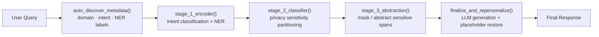

# 🛡️ Privacy-Preserving Contextually-Aware Prompt Sanitization Framework

A five-stage pipeline that lets an LLM answer a user's question **without ever seeing their PII** — automatically detecting sensitive entities, deciding which ones actually matter for the answer, masking the rest, and re-personalizing the response afterward.

> Ask an LLM "I have diabetes and I live at Flat 402, Mumbai — can I take ibuprofen?" and it never has to see your name, your address, or anything beyond what's actually needed to answer the medical question.

---

## Why this exists

Every time a user pastes a query into an LLM, they may be leaking names, addresses, account numbers, medical conditions, or API keys — most of which the model doesn't actually need to answer the question. Existing PII redaction tools are **static**: they strip every name or number regardless of whether it's relevant. This framework is **intent-aware**: it first figures out *what the user is actually trying to do*, then only protects the information that isn't required to do it correctly.

## How it works

The pipeline runs every query through five stages, dynamically discovering its own domain, intent, and entity schema instead of relying on a fixed label set.



| Stage | Function | What it does |
|---|---|---|
| 1 | `auto_discover_metadata()` | Zero-shot detects the query's **domain**, plausible **intents**, and a bespoke **NER label set** — no hardcoded schema required. |
| 2 | `stage_1_encoder()` | Runs intent classification and Named Entity Recognition using the dynamically discovered labels. |
| 3 | `stage_2_classifier()` | Partitions every detected entity into one of three buckets based on whether it's actually needed to fulfill the intent: `S_drop`, `S_abstract`, `T_core`. |
| 4 | `stage_3_abstraction()` | Deletes irrelevant PII outright and replaces essential-but-sensitive values with placeholders, building a reversible mapping table. |
| 5 | `finalize_and_repersonalize()` | Sends the sanitized query to a larger reasoning model, then swaps placeholders back into the generated answer. |

### The core privacy-sensitivity taxonomy

The heart of the system is a three-way classification of every entity in the query:

- **`S_drop`** — Sensitive data with **zero impact** on the answer (names, addresses, incidental IDs). Deleted entirely.
- **`S_abstract`** — Sensitive data that **is required** for a correct answer (a medical condition, an account balance). Replaced with a reversible placeholder like `[PROTECTED_VALUE_1]`.
- **`T_core`** — Non-sensitive or general technical terms that must stay untouched (drug names, library names, domain terminology).

This means the same word can be treated differently depending on context — e.g. *"Pascal"* is dropped as a name but preserved as a programming language, in the same sentence.

## Tech stack

| Component | Tool |
|---|---|
| Named Entity Recognition | [GLiNER](https://github.com/urchade/GLiNER) (`urchade/gliner_multi-v2.1`) — zero-shot, self-hosted |
| Intent classification | `facebook/bart-large-mnli` zero-shot classifier |
| Metadata discovery & sensitivity partitioning | Groq-hosted **Llama 3.1 8B Instant** |
| Final response generation | Groq-hosted **Llama 3.3 70B Versatile** |
| Semantic evaluation | `sentence-transformers` (`all-MiniLM-L6-v2`) |

Using a small, fast model for classification/routing and a larger model only for final generation keeps the sanitization overhead cheap while preserving answer quality.

## Rigorous benchmarking

The framework isn't just demoed on toy examples — it's evaluated against a **custom 1,000-sample benchmark** (`btp_privacy_benchmark_1000.csv`) spanning multiple domains (healthcare, finance, engineering, and more), each with ground-truth sensitive-token annotations.

**Evaluation design:**
- **20 independent runs** per sample to measure stability, not just single-shot accuracy.
- **Two averaging modes** for every score — micro (token-weighted) and macro (sample-weighted) — to avoid high-token-count samples dominating the results.
- **Cached, reproducible pipeline**: metadata discovery, NER predictions, and metrics are cached in separate stages so metrics can be recomputed instantly without re-calling any model.
- **Per-domain breakdown** to surface where the sanitizer over- or under-redacts.

**Metrics computed:**

| Metric | Measures |
|---|---|
| Token Recall / Precision / F1 | How well predicted sensitive tokens match ground truth |
| **Intent Preservation Score (IPS)** | Whether non-sensitive tokens needed to answer the query were incorrectly redacted |
| **Privacy Leakage Ratio (PLR)** | Fraction of ground-truth sensitive tokens that leaked through unmasked |

Domain and intent detection are additionally scored against ground truth using both **exact match** and **semantic cosine similarity**, so the system is credited for near-misses (e.g. predicting "Medical" vs. ground truth "Healthcare").

## Example

**Input:**
> "My name is Rajesh Kumar. I live at Flat 402, Mumbai. I lost my credit card 4567 1234 5678 9999 yesterday and I also have diabetes. Can I take ibuprofen safely?"

**What happens internally:**
- `Rajesh Kumar`, `Flat 402, Mumbai` → dropped (irrelevant to the medical question)
- `diabetes` → abstracted to `[PROTECTED_VALUE_1]` (needed for a safe answer)
- `ibuprofen` → preserved as-is (a general medical term, not PII)
- Credit card number → dropped entirely (irrelevant here)

The 70B model only ever sees a sanitized query about a placeholder medical condition and ibuprofen — and the final answer is re-personalized before being shown to the user.

## Repository contents

```
├── privacy-preserving-contextually-aware-framework.ipynb
│   ├── Core 5-stage pipeline (auto_discover_metadata → run_pipeline)
│   ├── Qualitative test cases across healthcare, finance, and engineering queries
│   └── Full benchmarking suite:
│       ├── Metadata cache builder (20-run experiment)
│       ├── Domain / intent evaluation vs. ground truth
│       ├── GLiNER prediction caching
│       └── Micro/macro metric computation (Recall, Precision, F1, IPS, PLR)
```

## Running it

Please run this inside a Kaggle Notebook as the heavy use of APIs and LLMs might create problems when running it in local. Most efficient way is to run it on Kaggle and manage user sessions from there.

```bash
pip install gliner transformers torch accelerate google-generativeai groq sentence-transformers

# Set your Groq API key, then:
python -c "from pipeline import run_pipeline; run_pipeline('your query here')"
```

The notebook is written for a Kaggle environment (`kaggle_secrets` for API keys, `/kaggle/input` for the benchmark dataset) but the core pipeline functions are environment-agnostic.
Please refer to our custom dataset and dowload it on Kaggle notebook before running the project.

---

Authors: Inarat Hussain, Srijan Sharma
